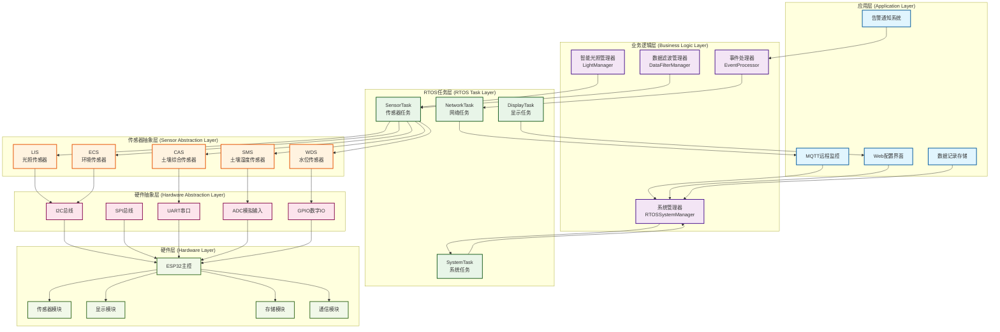
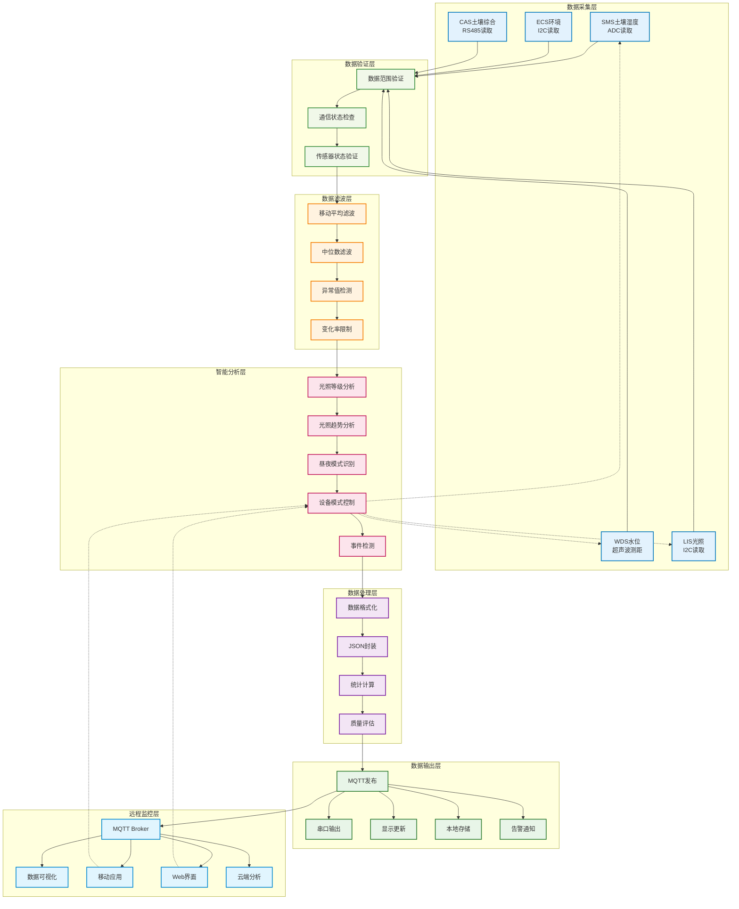

# ESP-32智能农业监测系统 🌱

[](https://github.com/your-repo/esp32-agriculture)
[](https://github.com/your-repo/esp32-agriculture/releases)
[](LICENSE)
[](https://www.espressif.com/en/products/socs/esp32)

## 📋 项目概述

ESP-32智能传感器管理系统是一个基于ESP32微控制器的多传感器数据采集、处理和管理平台。经过九个阶段的迭代优化，系统具备完整的传感器管理、数据滤波、智能光照分析和远程监控能力，适用于智能农业、智能家居、工业监控等多种应用场景。

### 🌟 主要特性

- **🔄 FreeRTOS多任务架构** - 高效的实时任务调度和资源管理
- **📡 MQTT标准通信** - 完全基于MQTT协议的物联网通信
- **🌡️ 多传感器集成** - SMS、WDS、LIS、ECS、CAS五种传感器类型
- **🔧 智能数据滤波** - 移动平均、中位数、异常值检测三级滤波
- **💡 智能光照管理** - 光照等级分析、趋势预测、模式自动切换
- **📱 Web配网界面** - 便捷的WiFi配置和系统管理
- **📊 实时数据显示** - OLED显示屏实时显示系统状态
- **🔧 远程命令控制** - 支持MQTT远程指令执行
- **📈 系统监控** - 完整的系统健康监测和错误报告
- **🛡️ 高可靠性** - 完整的错误处理和自动恢复机制

## 🏗️ 系统架构

### RTOS任务架构

```
┌─────────────────┐    ┌─────────────────┐    ┌─────────────────┐
│   传感器任务     │    │   网络通信任务   │    │   控制逻辑任务   │
│  (优先级: 3)    │    │  (优先级: 4)    │    │  (优先级: 5)    │
└─────────────────┘    └─────────────────┘    └─────────────────┘
         │                       │                       │
         └───────────────────────┼───────────────────────┘
                                 │
┌─────────────────┐    ┌─────────────────┐    ┌─────────────────┐
│   执行器任务     │    │   显示任务      │    │   看门狗任务     │
│  (优先级: 6)    │    │  (优先级: 2)    │    │  (优先级: 7)    │
└─────────────────┘    └─────────────────┘    └─────────────────┘
```

### 数据流架构

```
传感器数据 → 数据队列 → MQTT发布 → agriculture/{device_id}/data/sensors
     ↓           ↓           ↓
   本地显示 → 控制逻辑 → 执行器控制
                ↑
MQTT命令 ← agriculture/{device_id}/command/{type}
```

### MQTT主题结构

系统采用标准的MQTT主题命名规范：`agriculture/{device_id}/{message_type}/{sub_type}`

**数据上报主题：**
- `agriculture/ESP32_001/data/sensors` - 传感器数据
- `agriculture/ESP32_001/status/system` - 系统状态
- `agriculture/ESP32_001/data/alerts` - 告警信息

**命令下发主题：**
- `agriculture/ESP32_001/command/control` - 控制命令
- `agriculture/ESP32_001/command/system` - 系统命令
- `agriculture/ESP32_001/command/query` - 查询命令

**命令响应主题：**
- `agriculture/ESP32_001/response/command` - 命令执行结果

## 🛠️ 硬件要求

### 主控制器
- **ESP32 DevKit C** - 主控制器
- **内存**: 最少320KB RAM, 4MB Flash
- **WiFi**: 2.4GHz 802.11 b/g/n

### 传感器模块
- **土壤湿度传感器 (SMS)** - 电容式土壤湿度检测
- **环境传感器 (ECS)** - BME280 温湿度气压传感器
- **光照传感器 (LIS)** - BH1750 数字光照传感器
- **水位传感器 (WDS)** - 超声波水位检测
- **CAS综合传感器** - 多参数土壤分析

### 显示和控制
- **OLED显示屏** - SSD1306 128x64像素
- **继电器模块** - 灌溉控制输出
- **状态指示LED** - 系统运行状态指示

## 📁 项目结构

```
ESP-32-DevKitC/
├── src/                    # 主程序源码
│   └── main.cpp           # 程序入口点
├── lib/                   # 自定义库文件
│   ├── CommandProcessor/  # 命令处理器
│   ├── ConfigManager/     # 配置管理器
│   ├── ControlAgent/      # 控制代理
│   ├── DisplayManager/    # 显示管理器
│   ├── LogManager/        # 日志管理器
│   ├── NetworkManager/    # 网络管理器
│   ├── RTOSManager/       # RTOS任务管理器
│   ├── SensorManager/     # 传感器管理器
│   └── SystemManager/     # 系统管理器
├── include/               # 头文件目录
│   ├── ISCS/             # ISCS传感器模块
│   └── MSP20/            # MSP20水深传感器模块 (v2.0)
├── test/                  # 测试文件
│   ├── test_MSP20.cpp    # MSP20模块单元测试
│   ├── test_WDS.cpp      # WDS模块集成测试
│   └── ...               # 其他测试文件
├── data/                  # 数据文件（网页等）
├── platformio.ini         # PlatformIO配置文件
└── README.md             # 项目说明文档
```

### 🔄 模块架构更新 (v2.0)

**MSP20水深传感器模块重构：**
- 📁 **新位置**: `include/MSP20/` (从 `lib/SensorManager/` 迁移)
- 🔧 **优化内容**: 完全重构的API设计，支持多种测量模式
- 📝 **代码质量**: MSP20.cpp控制在300行以内，添加完整中文注释
- ⚡ **性能提升**: 优化的采样算法和异常值检测机制

**WDS水深管理模块增强：**
- 🧠 **智能分析**: 新增洪水检测、干旱预警、趋势分析功能
- 📊 **数据处理**: 改进的历史数据管理和统计分析
- 🔒 **错误处理**: 完善的错误检测和恢复机制
- 📝 **代码优化**: WDS.cpp控制在400行以内，提升可维护性

## 📦 安装指南

### 环境准备

1. **安装PlatformIO**
   ```bash
   # 使用pip安装
   pip install platformio
   
   # 或使用VS Code扩展
   # 在VS Code中搜索并安装"PlatformIO IDE"扩展
   ```

2. **克隆项目**
   ```bash
   git clone https://github.com/your-repo/esp32-agriculture.git
   cd esp32-agriculture
   ```

3. **安装依赖**
   ```bash
   pio lib install
   ```

### 编译和烧录

1. **编译项目**
   ```bash
   pio run
   ```

2. **烧录到ESP32**
   ```bash
   pio run --target upload
   ```

3. **监控串口输出**
   ```bash
   pio device monitor
   ```

### 程序文件说明

- **主程序**: `src/main.cpp` - ESP32 RTOS多任务主程序
- **测试程序**: `test/test_rtos_functionality.cpp` - 功能验证测试程序
- **MQTT测试**: `test/test_mqtt_rtos_integration.cpp` - MQTT集成测试

### 切换测试模式

#### RTOS功能测试：
```bash
# 备份主程序
mv src/main.cpp src/main_backup.cpp

# 使用RTOS测试程序
cp test/test_rtos_functionality.cpp src/main.cpp

# 编译运行测试
pio run --target upload

# 恢复主程序
mv src/main_backup.cpp src/main.cpp
```

#### MQTT重构功能测试：
```bash
# 备份主程序
mv src/main.cpp src/main_backup.cpp

# 使用MQTT测试程序
cp test/test_mqtt_refactoring.cpp src/main.cpp

# 修改测试程序中的WiFi和MQTT配置
# 编译运行测试
pio run --target upload

# 恢复主程序
mv src/main_backup.cpp src/main.cpp
```

**MQTT测试功能：**
- ✅ 自动发布传感器数据到正确主题
- ✅ 自动发布系统状态信息
- ✅ 自动发布告警信息
- ✅ 接收并处理控制命令
- ✅ 接收并处理系统命令
- ✅ 接收并处理查询命令
- ✅ 发送命令执行响应

### 硬件连接

#### 传感器连接
```
ESP32 Pin  →  传感器/模块
GPIO21     →  SDA (I2C数据线)
GPIO19     →  SCL (I2C时钟线)
GPIO27     →  继电器控制输出
GPIO34     →  土壤湿度传感器模拟输入
GPIO35     →  水位传感器模拟输入
3.3V       →  传感器电源正极
GND        →  传感器电源负极
```

#### OLED显示屏连接
```
ESP32 Pin  →  OLED Pin
GPIO21     →  SDA
GPIO19     →  SCL
3.3V       →  VCC
GND        →  GND
```

## 🚀 使用说明

### 首次配置

1. **WiFi配网**
   - 系统首次启动会创建热点"ESP32-Agriculture"
   - 连接热点后访问 `http://192.168.4.1`
   - 输入WiFi凭据完成配网

2. **MQTT服务器配置**
   - 在Web界面中配置MQTT服务器地址
   - 设置用户名和密码（如需要）
   - 配置设备ID和主题前缀

3. **传感器校准**
   - 系统会自动检测连接的传感器
   - 根据需要进行传感器校准
   - 设置灌溉阈值参数

### 🌊 WDS水深传感器使用指南 (v2.0)

**基本使用：**
```cpp
#include <SensorManager.h>

WDS waterSensor(35);  // 使用GPIO35

void setup() {
    // 初始化WDS传感器
    if (waterSensor.begin() == ErrorCode::SUCCESS) {
        Serial.println("WDS传感器初始化成功");

        // 配置采样参数
        waterSensor.setSamplingParameters(20, 10);

        // 执行校准（可选）
        waterSensor.calibrate(0.0, 1.0);  // 零点偏移，比例因子
    }
}

void loop() {
    // 读取水深数据
    double depthCm = waterSensor.readWaterDepth();
    double depthM = waterSensor.readWaterDepthMeters();

    // 获取水位等级
    WaterLevel level = waterSensor.getWaterLevel();

    // 检测洪水和干旱
    bool flooding = waterSensor.isFlooding();
    bool drought = waterSensor.isDry();

    // 获取统计数据
    double avgDepth = waterSensor.getAverageWaterDepth(10);
    double maxDepth = waterSensor.getMaxWaterDepth(60000);  // 1分钟内最大值

    Serial.printf("水深: %.2fcm, 等级: %d, 洪水: %s, 干旱: %s\n",
                  depthCm, (int)level, flooding?"是":"否", drought?"是":"否");

    delay(5000);
}
```

**高级功能：**
- 🔍 **智能分析**: 自动洪水检测、干旱预警、水位趋势分析
- 📊 **历史数据**: 支持最近20次测量的历史数据管理
- 🎯 **精确测量**: 异常值检测和数据滤波，提高测量稳定性
- ⚡ **RTOS兼容**: 完全支持FreeRTOS多任务环境
- 🔧 **错误恢复**: 完善的错误检测和自动恢复机制

### 日常操作

#### Web界面操作
- **实时监控**: 查看传感器数据和系统状态
- **参数设置**: 调整灌溉阈值和系统参数
- **历史数据**: 查看数据趋势和历史记录
- **系统管理**: 重启系统、恢复出厂设置

#### MQTT命令控制

**控制命令** (发送到 `agriculture/ESP32_001/command/control`):
```json
// 强制开启灌溉
{
  "command": "FORCE_ON",
  "parameters": {
    "duration": 30
  },
  "message_id": "cmd_001",
  "timestamp": 1640995200
}

// 设置灌溉阈值
{
  "command": "SET_THRESHOLD",
  "parameters": {
    "low_threshold": 30,
    "high_threshold": 70
  },
  "message_id": "cmd_002",
  "timestamp": 1640995200
}
```

**系统命令** (发送到 `agriculture/ESP32_001/command/system`):
```json
// 重启系统
{
  "command": "RESTART",
  "parameters": {
    "delay": 5
  },
  "message_id": "cmd_003",
  "timestamp": 1640995200
}
```

**查询命令** (发送到 `agriculture/ESP32_001/command/query`):
```json
// 获取系统状态
{
  "command": "GET_STATUS",
  "parameters": {
    "include": ["system", "sensors", "network"]
  },
  "message_id": "cmd_004",
  "timestamp": 1640995200
}
```

## 📊 数据格式

### 传感器数据上报 (agriculture/ESP32_001/data/sensors)
```json
{
  "timestamp": 1640995200,
  "device_id": "ESP32_001",
  "message_id": "msg_001",
  "data": {
    "soil_moisture": {
      "value": 45.6,
      "unit": "%",
      "quality": "good",
      "timestamp": 1640995200
    },
    "temperature": {
      "value": 25.8,
      "unit": "°C",
      "quality": "good",
      "timestamp": 1640995200
    },
    "humidity": {
      "value": 62.3,
      "unit": "%",
      "quality": "good",
      "timestamp": 1640995200
    },
    "light_intensity": {
      "value": 1250,
      "unit": "lux",
      "quality": "good",
      "timestamp": 1640995200
    },
    "water_level": {
      "value": 18.5,
      "unit": "cm",
      "quality": "good",
      "timestamp": 1640995200
    }
  }
}
```

### 系统状态报告 (agriculture/ESP32_001/status/system)
```json
{
  "timestamp": 1640995200,
  "device_id": "ESP32_001",
  "status": {
    "online": true,
    "system_state": "NORMAL",
    "wifi_rssi": -45,
    "free_heap": 185000,
    "uptime": 86400,
    "tasks": {
      "sensor_task": "healthy",
      "network_task": "healthy",
      "control_task": "healthy",
      "display_task": "healthy",
      "watchdog_task": "healthy"
    },
    "irrigation": {
      "active": false,
      "last_activation": 1640991600,
      "total_runtime": 1800
    }
  }
}
```

### 告警信息上报 (agriculture/ESP32_001/data/alerts)
```json
{
  "timestamp": 1640995200,
  "device_id": "ESP32_001",
  "alert": {
    "level": "WARNING",
    "type": "SENSOR_ERROR",
    "message": "土壤湿度传感器读取异常",
    "sensor": "soil_moisture",
    "value": null,
    "threshold": null,
    "action_required": true
  }
}
```

## 🔧 配置参数

### 系统配置 (config.json)
```json
{
  "device": {
    "id": "ESP32_001",
    "name": "农业监测站1号",
    "location": "温室A区"
  },
  "network": {
    "wifi_ssid": "YourWiFi",
    "wifi_password": "YourPassword",
    "mqtt_server": "mqtt.example.com",
    "mqtt_port": 1883,
    "mqtt_username": "username",
    "mqtt_password": "password"
  },
  "sensors": {
    "soil_moisture": {
      "enabled": true,
      "pin": 34,
      "calibration": {
        "dry_value": 4095,
        "wet_value": 1500
      }
    },
    "environment": {
      "enabled": true,
      "i2c_address": "0x76"
    }
  },
  "irrigation": {
    "enabled": true,
    "pin": 27,
    "thresholds": {
      "low": 30,
      "high": 70
    },
    "max_duration": 300
  }
}
```

## 🐛 故障排除

### 常见问题

#### 1. 编译错误
```bash
# 清理构建缓存
pio run --target clean

# 重新安装依赖
pio lib install --force

# 检查PlatformIO版本
pio --version
```

#### 2. WiFi连接问题
- 检查WiFi凭据是否正确
- 确认WiFi信号强度足够
- 重启设备重新配网

#### 3. MQTT连接失败
- 验证MQTT服务器地址和端口
- 检查用户名密码配置
- 确认网络防火墙设置

#### 4. 传感器读取异常
- 检查传感器连接线路
- 验证I2C地址配置
- 重新校准传感器

### 调试模式

启用详细日志输出：
```cpp
// 在main.cpp中设置日志级别
globalLogManager->setLevel(ILogger::Level::VERBOSE);
```

查看系统状态：
```bash
# 监控串口输出
pio device monitor --baud 115200

# 查看任务状态
# 系统会定期输出任务健康状态和资源使用情况
```

## 📈 性能优化

### 内存优化
- **当前内存使用**: RAM 14.9%, Flash 86.4%
- **优化建议**: 
  - 减少字符串常量使用
  - 优化数据结构大小
  - 使用PROGMEM存储常量数据

### 任务调度优化
- **任务优先级**: 看门狗(7) > 执行器(6) > 控制(5) > 网络(4) > 传感器(3) > 显示(2)
- **建议**: 根据实际需求调整任务优先级和执行频率

### 网络性能优化
- **MQTT QoS**: 使用QoS 1确保消息可靠传输
- **心跳间隔**: 设置合适的keep-alive时间
- **重连机制**: 实现指数退避重连策略

## 🤝 贡献指南

欢迎提交Issue和Pull Request！

### 开发流程
1. Fork项目
2. 创建功能分支 (`git checkout -b feature/AmazingFeature`)
3. 提交更改 (`git commit -m 'Add some AmazingFeature'`)
4. 推送到分支 (`git push origin feature/AmazingFeature`)
5. 创建Pull Request

### 代码规范
- 使用中文注释
- 遵循现有代码风格
- 添加必要的单元测试
- 更新相关文档

## 📚 完整文档

### 系统级文档

| 文档                           | 描述           | 适用对象       |
|------------------------------|--------------|------------|
| [系统架构设计文档](docs/系统架构设计文档.md) | 详细的系统架构和设计说明 | 架构师、高级开发者  |
| [API参考手册](docs/API参考手册.md)   | 完整的API接口文档   | 开发者、集成商    |
| [部署配置指南](docs/部署配置指南.md)     | 硬件连接和软件配置指南  | 系统管理员、技术人员 |
| [开发者指南](docs/开发者指南.md)       | 开发规范和扩展方法    | 开发者、贡献者    |
| [用户使用手册](docs/用户使用手册.md)     | 用户操作和功能说明    | 最终用户、操作员   |

### 快速链接

- 📖 [完整文档目录](docs/)
- 🏗️ [系统架构](docs/系统架构设计文档.md)
- 🔧 [API参考](docs/API参考手册.md)
- 🚀 [部署指南](docs/部署配置指南.md)
- 💡 [开发指南](docs/开发者指南.md)
- 📱 [用户手册](docs/用户使用手册.md)

### 文档特色

- **中英文双语支持** - 重点提供中文文档
- **完整的代码示例** - 每个API都有详细示例
- **图表丰富** - 包含架构图、连接图、流程图
- **分层文档** - 适合不同技术水平的用户
- **实时更新** - 随系统版本同步更新

## 📄 许可证

本项目采用MIT许可证 - 查看 [LICENSE](LICENSE) 文件了解详情。

## 📞 联系方式

- **项目维护者**: [Zelas2Xerath]
- **邮箱**: your.email@example.com
- **项目主页**: https://github.com/your-repo/esp32-agriculture

## 🙏 致谢

感谢以下开源项目的支持：
- [ESP32 Arduino Core](https://github.com/espressif/arduino-esp32)
- [PlatformIO](https://platformio.org/)
- [ArduinoJson](https://arduinojson.org/)
- [PubSubClient](https://github.com/knolleary/pubsubclient)
- [U8g2](https://github.com/olikraus/u8g2)

---

**🌱 让科技助力农业，让智慧点亮田野！**

## 创建系统架构图



## 创建数据流程图



