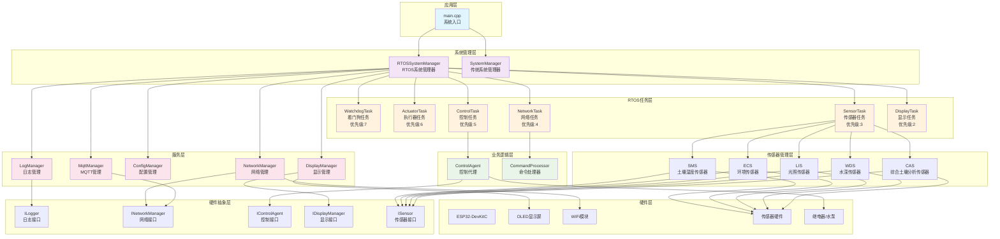
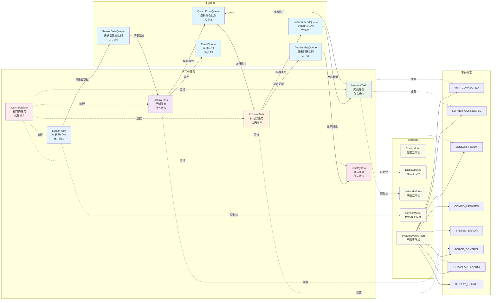
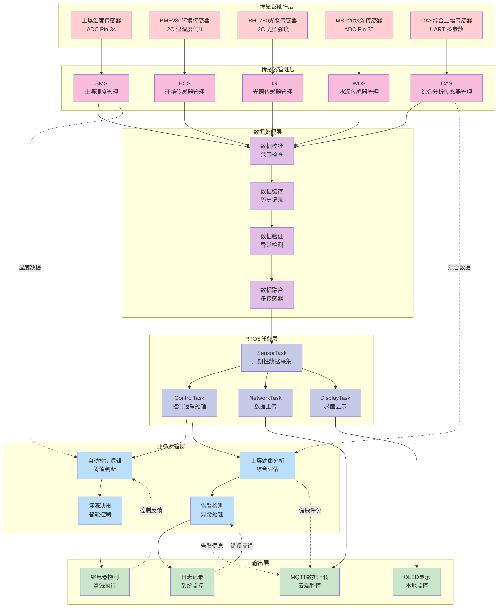

# ESP32 土壤监测系统项目分析报告

## 1. 项目概述

### 1.1 基本信息
- **项目名称**: Esp-32-DevKitC 土壤监测系统
- **项目类型**: 嵌入式物联网项目
- **开发语言**: C/C++
- **硬件平台**: ESP32-DevKitC
- **开源许可**: MIT
- **版本**: 4.2.0 Beta - RTOS重构版本

### 1.2 项目目标
该项目旨在实现一个基于ESP32的智能土壤监测与自动灌溉控制系统，具备以下核心功能：
- 实时监测土壤综合性质（湿度、温度、EC值、盐分、NPK、PH等）
- 自动控制灌溉系统
- 支持远程指令控制
- 提供OLED显示界面
- 基于MQTT协议的物联网通信

### 1.3 技术栈
- **硬件**: ESP32-DevKitC、OLED显示屏、多种传感器（BME280、BH1750、CAS土壤传感器等）
- **框架**: Arduino Framework + FreeRTOS
- **通信协议**: WiFi + MQTT
- **开发环境**: PlatformIO
- **依赖库**: U8g2、ArduinoLog、WiFiManager、ArduinoJson、PubSubClient等

## 2. 架构设计分析

### 2.1 整体架构
项目采用**分层模块化架构**，结合**FreeRTOS多任务并发设计**：

```
┌─────────────────────────────────────────────────────────┐
│                    应用层 (main.cpp)                    │
├─────────────────────────────────────────────────────────┤
│              系统管理层 (SystemManager)                 │
├─────────────────────────────────────────────────────────┤
│  业务逻辑层 (ControlAgent, CommandProcessor, etc.)     │
├─────────────────────────────────────────────────────────┤
│     服务层 (NetworkManager, SensorManager, etc.)       │
├─────────────────────────────────────────────────────────┤
│              RTOS任务层 (RTOSManager)                   │
├─────────────────────────────────────────────────────────┤
│                硬件抽象层 (Interfaces)                  │
└─────────────────────────────────────────────────────────┘
```

### 2.2 RTOS任务架构
系统采用6个核心任务的并发架构：

| 任务名称 | 优先级 | 堆栈大小 | 主要职责 |
|---------|--------|----------|----------|
| WatchdogTask | 7 | 2048 | 系统监控和故障恢复 |
| ActuatorTask | 6 | 2048 | 硬件执行器控制 |
| ControlTask | 5 | 3072 | 业务逻辑控制 |
| NetworkTask | 4 | 8192 | 网络通信和MQTT |
| SensorTask | 3 | 4096 | 传感器数据采集 |
| DisplayTask | 2 | 3072 | 显示界面更新 |

### 2.3 设计模式应用
- **接口隔离原则**: 大量使用接口抽象（ILogger、INetworkManager、IControlAgent等）
- **单一职责原则**: 每个模块职责明确，如NetworkManager专注WiFi连接，MqttManager专注MQTT通信
- **依赖注入**: 通过构造函数注入依赖，降低耦合度
- **观察者模式**: 事件驱动的消息队列机制

## 3. 功能模块详细分析

### 3.1 系统管理模块 (SystemManager)

**核心职责**:
- 统一管理所有系统组件的生命周期
- 协调各模块间的交互
- 系统状态管理和错误处理

**关键特性**:
- 支持传统循环模式和RTOS模式双重架构
- 完善的初始化流程和错误恢复机制
- 统一的配置管理和状态监控

**代码示例**:
```cpp
ErrorCode RTOSSystemManager::begin(U8G2_SSD1306_128X64_NONAME_F_HW_I2C& oled, Preferences& prefs) {
    // 初始化系统组件
    ErrorCode result = initializeComponents(oled, prefs);
    if (result != ErrorCode::SUCCESS) {
        return result;
    }
    
    // 初始化传感器
    result = initializeSensors();
    if (result != ErrorCode::SUCCESS) {
        return result;
    }
    
    // 初始化管理器
    result = initializeManagers(prefs);
    return result;
}
```

### 3.2 传感器管理模块 (SensorManager)

**支持的传感器类型**:
- **SMS (Soil Moisture Sensor)**: 土壤湿度传感器
- **ECS (Environment Control System)**: BME280环境传感器（温湿度、气压）
- **LIS (Light Intensity Sensor)**: BH1750光照传感器
- **WDS (Water Depth Sensor)**: MSP20水深传感器
- **CAS (Comprehensive Analysis Sensor)**: 综合土壤分析传感器

**设计亮点**:
- 统一的传感器接口设计
- 自动校准和数据验证
- 历史数据记录和统计分析
- 错误处理和异常恢复

**CAS传感器的土壤健康分析**:
```cpp
SoilHealthStatus CAS::analyzeSoilHealth(const SoilSensorData& data) {
    SoilHealthStatus status;
    status.type = determineSoilType(data);
    status.quality = evaluateSoilQuality(data);
    status.healthScore = calculateHealthScore(data);
    status.isSuitableForCrops = isSuitableForCrops(data);
    status.recommendations = generateRecommendations(data);
    return status;
}
```

### 3.3 网络通信模块

**架构重构亮点**:
项目进行了重要的网络架构重构，将原本的单一NetworkManager拆分为：
- **NetworkManager**: 专注WiFi连接和网络质量管理
- **MqttManager**: 专门负责MQTT通信

**NetworkManager职责**:
- WiFi连接管理和自动重连
- 网络状态监控和质量评估
- 时间同步管理

**MqttManager职责**:
- MQTT连接管理和自动重连
- 消息发布和订阅
- 命令消息转发到CommandProcessor

### 3.4 控制代理模块 (ControlAgent)

**核心功能**:
- 自动灌溉控制逻辑
- 强制控制模式
- 系统状态管理
- 阈值配置和持久化

**控制逻辑**:
```cpp
bool ControlAgent::autoControl(int moisture) const {
    if (forceMode || !irrigationEnabled) {
        return false;
    }
    
    if (moisture < lowThreshold) {
        digitalWrite(controlPin, HIGH);  // 启动灌溉
    } else if (moisture > highThreshold) {
        digitalWrite(controlPin, LOW);   // 停止灌溉
    }
    
    return prevPinState != digitalRead(controlPin);
}
```

**状态机设计**:
- 支持NORMAL、WARNING、ERROR、CRITICAL四种状态
- 自动状态恢复机制
- 状态变化历史记录

### 3.5 配置管理模块 (ConfigManager)

**功能特性**:
- 基于NVS的配置持久化
- WiFi配网门户
- MQTT连接参数管理
- 设备ID标准化

**配网功能**:
- 支持AP模式配网
- Web界面配置
- 配置验证和错误处理

### 3.6 显示管理模块 (DisplayManager)

**设计特点**:
- 支持1-4行文本显示
- 内容缓存避免频繁刷新
- 进度条和错误信息显示
- 中文字体支持

### 3.7 日志管理模块 (LogManager)

**功能特性**:
- 7级日志等级（SILENT到VERBOSE）
- 格式化日志输出
- 结构化错误信息记录
- 静态和实例方法双重支持

## 4. RTOS架构深度分析

### 4.1 任务间通信机制

**消息队列设计**:
- 5个专用消息队列
- 类型安全的消息结构
- 超时机制和错误处理

**同步机制**:
- 4个互斥锁保护共享资源
- 事件组实现任务协调
- 心跳机制监控任务健康

### 4.2 内存管理

**堆栈分配策略**:
- 根据任务复杂度合理分配堆栈大小
- NetworkTask分配最大堆栈（8192字节）
- 总堆栈使用约25KB

**内存保护机制**:
- 堆栈溢出检测
- 内存分配失败处理
- 动态内存监控

### 4.3 错误处理和恢复

**多层错误处理**:
- 任务级错误处理
- 系统级错误恢复
- 硬件故障检测

**故障恢复策略**:
- 任务重启机制
- 系统状态降级
- 自动重连功能

## 5. 代码质量评估

### 5.1 代码可读性 ⭐⭐⭐⭐☆

**优点**:
- 命名规范清晰，采用驼峰命名法和匈牙利命名法
- 丰富的中文注释，便于理解业务逻辑
- 良好的代码格式和缩进
- 完善的文档说明（README文件）

**示例 - 清晰的命名和注释**:
```cpp
/**
 * @brief 根据当前湿度执行自动控制
 * @param moisture 当前湿度值
 * @return 控制状态是否发生变化
 */
bool ControlAgent::autoControl(int moisture) const {
    // 只有在非强制模式且灌溉启用时执行自动控制
    if (forceMode || !irrigationEnabled) {
        return false;
    }
    // ... 控制逻辑
}
```

**需要改进**:
- 部分魔法数字缺少常量定义
- 某些复杂函数缺少详细注释

### 5.2 代码结构与设计 ⭐⭐⭐⭐⭐

**优点**:
- 严格遵循SOLID原则
- 接口隔离设计优秀，大量使用抽象接口
- 模块职责单一，耦合度低
- 依赖注入降低了模块间依赖

**设计模式应用**:
- **接口隔离**: ILogger、INetworkManager、IControlAgent等
- **单一职责**: NetworkManager和MqttManager的分离
- **依赖注入**: 构造函数注入依赖对象

**架构层次清晰**:
```
应用层 → 系统管理层 → 业务逻辑层 → 服务层 → RTOS任务层 → 硬件抽象层
```

### 5.3 性能与效率 ⭐⭐⭐☆☆

**优点**:
- RTOS多任务并发提高系统响应性
- 消息队列机制避免阻塞
- 显示缓存减少不必要的刷新
- 传感器数据缓存和历史记录

**性能瓶颈识别**:
1. **频繁的动态内存分配**:
   ```cpp
   // 在RTOSSystemManager中频繁使用new操作
   _configManager = new ConfigManager();
   _displayManager = new DisplayManager(oled);
   ```

2. **字符串操作开销**:
   ```cpp
   // 大量String对象创建和拷贝
   String getTaskStatus() const {
       DynamicJsonDocument doc(512);
       // ... JSON序列化
       String result;
       serializeJson(doc, result);
       return result;
   }
   ```

3. **传感器轮询开销**:
   - 多个传感器同步读取可能造成I2C总线竞争
   - 缺少传感器读取优先级管理

### 5.4 可维护性与扩展性 ⭐⭐⭐⭐☆

**优点**:
- 模块化设计便于维护和扩展
- 接口抽象支持不同实现
- 配置参数化，易于调整
- 完善的错误处理机制

**扩展性体现**:
- 新增传感器只需实现对应接口
- 支持不同的网络协议（当前支持MQTT）
- 显示接口支持不同类型显示设备

**维护性问题**:
- 部分类过于庞大（如SystemManager）
- 配置参数分散在多个文件中
- 缺少统一的配置管理中心

### 5.5 安全性与健壮性 ⭐⭐⭐☆☆

**安全措施**:
- 输入参数验证
- 边界条件检查
- 超时机制防止死锁
- 堆栈溢出保护

**健壮性设计**:
```cpp
// 参数验证示例
ErrorCode ControlAgent::setThresholds(int low, int high) {
    if (low >= high || low < 0 || low > 100 || high < 0 || high > 100) {
        LOG_ERROR("阈值设置无效，低阈值必须小于高阈值且在0-100范围内");
        return ErrorCode::THRESHOLD_INVALID;
    }
    // ...
}
```

**安全隐患**:
1. **WiFi密码明文存储**
2. **MQTT认证信息缺少加密**
3. **缺少固件更新安全验证**
4. **网络通信缺少TLS加密**

### 5.6 测试覆盖与可测试性 ⭐⭐☆☆☆

**现有测试**:
- 单元测试覆盖主要模块
- 集成测试验证RTOS功能
- 硬件在环测试

**测试文件分析**:
```
test/
├── test_device_id_normalization.cpp
├── test_mqtt_compatibility.cpp
├── test_rtos_functionality.cpp
└── ...

test_backup/
├── test_cas_sensor.cpp
├── test_log_manager.cpp
├── test_sensor_manager.cpp
└── ...
```

**可测试性问题**:
- 硬件依赖过强，难以进行纯软件测试
- 缺少Mock对象和依赖注入测试
- 集成测试覆盖不足
- 缺少性能和压力测试

## 6. 重大问题识别与分析

### 6.1 架构层面问题

**问题1: 系统管理器职责过重**
- **现象**: RTOSSystemManager类承担了过多职责
- **影响**: 违反单一职责原则，难以维护和测试
- **建议**: 拆分为多个专门的管理器

**问题2: 内存管理策略不当**
- **现象**: 大量使用动态内存分配，缺少内存池
- **影响**: 可能导致内存碎片和分配失败
- **建议**: 实现内存池管理，减少动态分配

### 6.2 性能问题

**问题1: 传感器读取效率低**
- **现象**: 传感器串行读取，I2C总线利用率低
- **影响**: 数据采集延迟，系统响应性差
- **建议**: 实现传感器读取调度和优先级管理

**问题2: 字符串操作开销大**
- **现象**: 频繁的String对象创建和JSON序列化
- **影响**: 内存消耗大，GC压力高
- **建议**: 使用字符串池和预分配缓冲区

### 6.3 安全问题

**问题1: 网络安全缺失**
- **现象**: WiFi和MQTT通信未加密
- **影响**: 数据传输安全风险
- **建议**: 实现TLS/SSL加密通信

**问题2: 配置信息安全**
- **现象**: 敏感信息明文存储
- **影响**: 设备被攻击时信息泄露
- **建议**: 实现配置加密存储

### 6.4 可靠性问题

**问题1: 错误恢复机制不完善**
- **现象**: 部分错误情况下系统无法自动恢复
- **影响**: 系统稳定性差，需要人工干预
- **建议**: 完善故障检测和自动恢复机制

**问题2: 看门狗机制简化**
- **现象**: 看门狗任务功能相对简单
- **影响**: 无法及时发现和处理系统异常
- **建议**: 增强看门狗功能，实现智能故障诊断

## 7. 改进建议与重构方案

### 7.1 架构优化建议

**建议1: 实现微服务化架构**
```cpp
// 建议的新架构
class ServiceManager {
    SensorService* sensorService;
    NetworkService* networkService;
    ControlService* controlService;
    DisplayService* displayService;
};

class SensorService {
    virtual ErrorCode startSensorCollection() = 0;
    virtual SensorData getLatestData() = 0;
    virtual ErrorCode calibrateSensor(SensorType type) = 0;
};
```

**建议2: 实现事件驱动架构**
```cpp
class EventBus {
    void subscribe(EventType type, EventHandler* handler);
    void publish(Event event);
    void unsubscribe(EventType type, EventHandler* handler);
};

// 使用示例
eventBus.subscribe(SENSOR_DATA_READY, controlService);
eventBus.publish(Event{MOISTURE_CHANGED, moistureValue});
```

### 7.2 性能优化方案

**方案1: 内存池管理**
```cpp
class MemoryPool {
    void* allocate(size_t size);
    void deallocate(void* ptr);
    size_t getFragmentation();
    size_t getUsage();
};

// 预分配常用对象池
ObjectPool<SensorDataMessage> sensorDataPool(10);
ObjectPool<ControlCommandMessage> controlCmdPool(5);
```

**方案2: 传感器调度优化**
```cpp
class SensorScheduler {
    void addSensor(ISensor* sensor, uint32_t interval, uint8_t priority);
    void schedule();
    void handleI2CConflict();
};

// 优先级调度
scheduler.addSensor(moistureSensor, 5000, PRIORITY_HIGH);
scheduler.addSensor(lightSensor, 10000, PRIORITY_LOW);
```

### 7.3 安全加固方案

**方案1: 通信加密**
```cpp
class SecureNetworkManager : public INetworkManager {
    ErrorCode connectSecureWiFi(const char* ssid, const char* password);
    ErrorCode setupTLS();
    ErrorCode verifyServerCertificate();
};

class SecureMqttManager {
    ErrorCode connectWithTLS();
    ErrorCode encryptPayload(const String& data);
    String decryptPayload(const String& encryptedData);
};
```

**方案2: 配置加密存储**
```cpp
class SecureConfigManager {
    ErrorCode saveEncryptedConfig(const NetworkConfig& config);
    NetworkConfig loadDecryptedConfig();
    ErrorCode rotateEncryptionKey();
};
```

### 7.4 可靠性增强方案

**方案1: 智能故障诊断**
```cpp
class SystemDiagnostics {
    HealthStatus checkSystemHealth();
    ErrorCode diagnoseNetworkIssues();
    ErrorCode diagnoseSensorIssues();
    ErrorCode performSelfTest();
};

class AdvancedWatchdog {
    void registerTask(TaskHandle_t task, uint32_t timeout);
    void feedWatchdog(TaskHandle_t task);
    void handleTaskTimeout(TaskHandle_t task);
    void performSystemRecovery();
};
```

**方案2: 数据备份与恢复**
```cpp
class DataBackupManager {
    ErrorCode backupCriticalData();
    ErrorCode restoreFromBackup();
    ErrorCode validateDataIntegrity();
};
```

### 7.5 代码重构建议

**重构1: 分离SystemManager职责**
```cpp
// 当前的庞大SystemManager拆分为：
class ComponentManager;     // 组件生命周期管理
class ConfigurationManager; // 配置管理
class StateManager;        // 状态管理
class ErrorManager;        // 错误处理
```

**重构2: 统一错误处理**
```cpp
class ErrorHandler {
    static ErrorCode handle(ErrorCode code, const char* context);
    static void registerErrorCallback(ErrorCode code, ErrorCallback callback);
    static ErrorInfo getDetailedError(ErrorCode code);
};
```

### 7.6 测试改进方案

**方案1: Mock框架实现**
```cpp
class MockSensor : public ISensor {
    MOCK_METHOD(ErrorCode, begin, (), (override));
    MOCK_METHOD(SensorData, readData, (), (override));
    MOCK_METHOD(ErrorCode, calibrate, (), (override));
};

class MockNetworkManager : public INetworkManager {
    MOCK_METHOD(bool, isConnected, (), (override));
    MOCK_METHOD(ErrorCode, sendData, (const String&), (override));
};
```

**方案2: 自动化测试流水线**
```yaml
# CI/CD配置示例
test_pipeline:
  - unit_tests
  - integration_tests
  - hardware_simulation_tests
  - performance_tests
  - security_tests
```

## 8. 项目亮点与创新点

### 8.1 技术亮点

1. **RTOS多任务架构**: 充分利用ESP32双核优势，实现真正的并发处理
2. **模块化设计**: 高度解耦的模块设计，便于维护和扩展
3. **接口抽象**: 大量使用接口抽象，提高代码的可测试性和可替换性
4. **智能传感器管理**: CAS传感器的土壤健康分析功能
5. **网络架构重构**: NetworkManager和MqttManager的分离体现了良好的架构演进

### 8.2 业务创新

1. **综合土壤分析**: 不仅监测湿度，还包括EC值、盐分、NPK、PH等多维度分析
2. **智能灌溉控制**: 基于多传感器数据的智能决策
3. **远程监控**: 完整的物联网解决方案
4. **故障自恢复**: 多层次的错误处理和自动恢复机制

### 8.3 工程实践亮点

1. **完善的日志系统**: 7级日志等级，结构化错误信息
2. **配网功能**: 用户友好的WiFi配置界面
3. **中文支持**: 完整的中文显示和注释
4. **文档完善**: 详细的README和模块说明文档

## 9. 总结与建议

### 9.1 项目总体评价

这是一个**架构设计优秀、功能完整、工程实践良好**的嵌入式物联网项目。项目体现了以下特点：

**优势**:
- ⭐⭐⭐⭐⭐ 架构设计：模块化、接口化设计优秀
- ⭐⭐⭐⭐☆ 功能完整性：覆盖了土壤监测的各个方面
- ⭐⭐⭐⭐☆ 代码质量：命名规范、注释完善
- ⭐⭐⭐☆☆ 性能表现：RTOS架构提供良好并发性
- ⭐⭐⭐☆☆ 安全性：基本的输入验证和错误处理

**需要改进的方面**:
- 内存管理策略需要优化
- 网络安全需要加强
- 测试覆盖率需要提高
- 部分模块职责需要进一步分离

### 9.2 发展建议

**短期目标（1-3个月）**:
1. 实现内存池管理，减少动态内存分配
2. 加强网络通信安全，实现TLS加密
3. 完善单元测试，提高测试覆盖率
4. 优化传感器读取调度

**中期目标（3-6个月）**:
1. 实现微服务化架构重构
2. 添加OTA固件更新功能
3. 实现数据本地存储和同步
4. 开发移动端监控应用

**长期目标（6-12个月）**:
1. 支持多设备集群管理
2. 实现AI驱动的智能决策
3. 开发云端数据分析平台
4. 支持更多类型的传感器和执行器

### 9.3 最终评价

该项目是一个**高质量的嵌入式物联网解决方案**，展现了良好的工程实践和架构设计能力。虽然存在一些可以改进的地方，但整体架构合理、功能完整、代码质量较高。项目的RTOS重构体现了对系统性能和可靠性的追求，是一个值得学习和参考的优秀项目。

**推荐指数**: ⭐⭐⭐⭐☆ (4.2/5.0)

---

*本分析报告基于对项目源代码的深度分析，涵盖了架构设计、功能模块、代码质量、性能表现等多个维度。报告中的建议和改进方案可作为项目后续发展的参考依据。*








###### 
